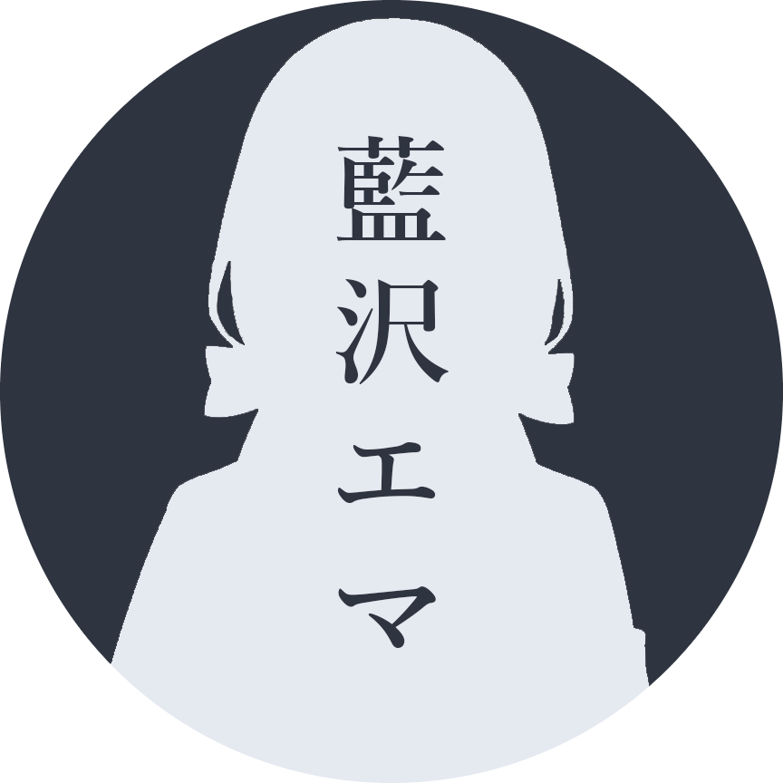
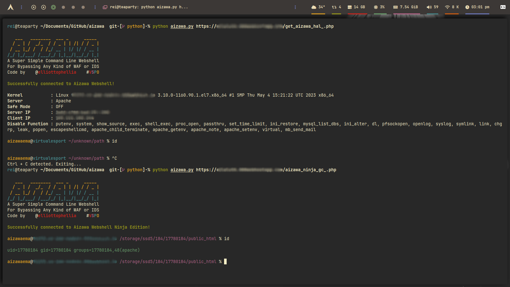

<p align='center'>
<br/><br/>
Aizawa is a super simple command-line webshell that executes commands via the HTTP request in order to <b>avoid any WAF or IDS while bypassing disable_function</b>. The name Aizawa itself is taken from virtual youtuber <a href="https://www.youtube.com/channel/UCPkKpOHxEDcwmUAnRpIu-Ng">Aizawa Ema</a> from <a href="https://vspo.jp/">Virtual Esport Project</a>. Ema herself is a girl who likes bread and cats. She's always trying to improve her game skills. She wants to be a neat and tidy character, but is she really?<br/><br/>  <br/><a href="https://www.paypal.com/paypalme/elliottophellia"></a> <a href="https://saweria.co/elliottophellia"></a>
</p>
<h1></h1>
<p align='center'>
<a href="#Changelogs"></a> <a href="#Prerequisites"></a> <a href="#Installing"></a> <a href="#Screenshot"></a> <a href="#References"></a> <a href="#Licence"></a> <a href="#Disclaimer"></a>
</p>
<h1></h1>

# Changelogs - v1.4.1

- Little cleanup of the code
    - Moved all validating process into Validators class
    - Moved all information printing process into Utilities
    - Moved command execution process into Executor class
    - Moved all colors into colors folder to avoid circular dependency
    - Moved Header class into header folder to avoid circular dependency
    - Moved Ping from Executor class to Ping function to avoid confusion
    - Added docstrings so i'm not forget what the fuck i did last time

Compare [v1.4.0...v1.4.1](https://github.com/elliottophellia/aizawa/compare/v1.4.0...v1.4.1)

# Prerequisites

- Python 3.10
- Pip 22.0.2 
- Httpx[http2] 0.25.0
- Validators 0.22.0

# Installing

### 1. Clone this repository
```
git clone http://github.com/elliottopellia/aizawa
```
### 2. Change directory to aizawa
```
cd aizawa
```
### 3. Install dependencies
```
Windows, Linux, Mac, Termux:
pip install -r requirements.txt

Arch Linux based:
pacman -S python-httpx python-validators python-h2
```
### 4. Run aizawa
```
python main.py / python main.py [webshell url]
```

# Screenshot




# References

- [s0md3v](https://github.com/s0md3v/nano)
- [Acunetix](https://bit.ly/AcunetiX)
- [mm0r1](https://github.com/mm0r1/exploits)

# Licence

This project is licensed under the GPL 2.0 License - see the [LICENCE](https://github.com/elliottophellia/aizawa/blob/main/LICENSE) file for details

# Disclaimer

This project is for educational purposes only. I will not be responsible for any misuse of this project by any party, or any damage caused by this project.

