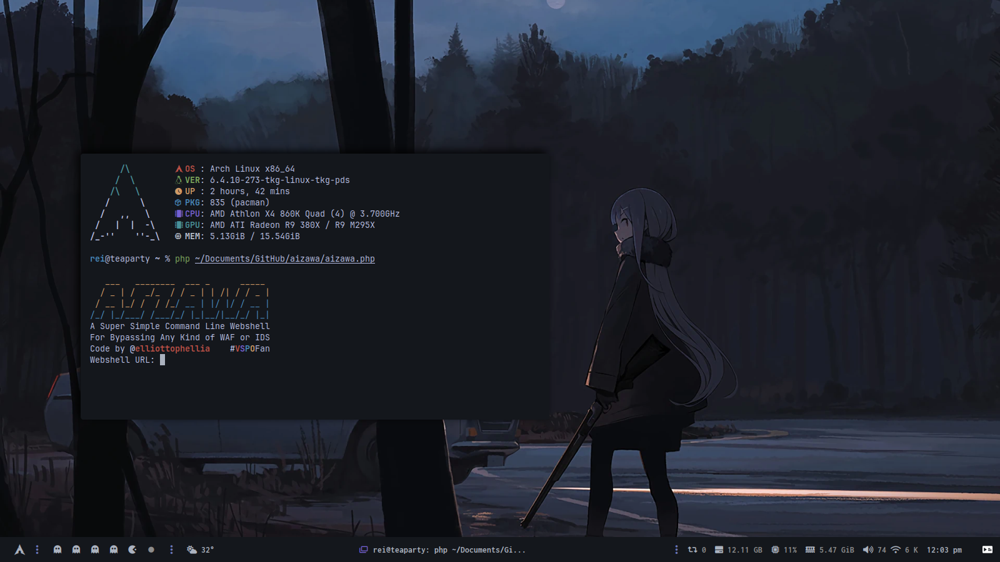
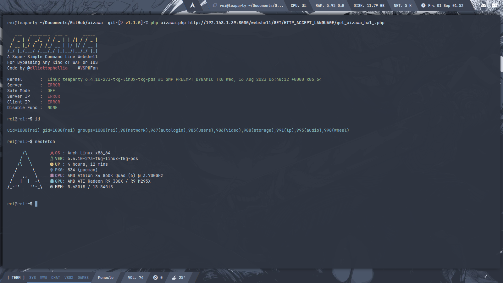
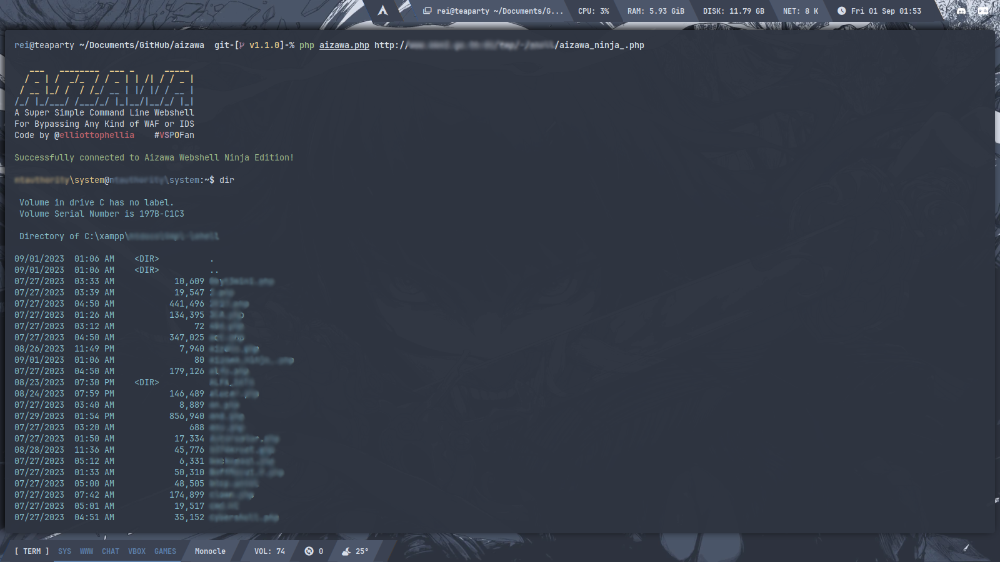
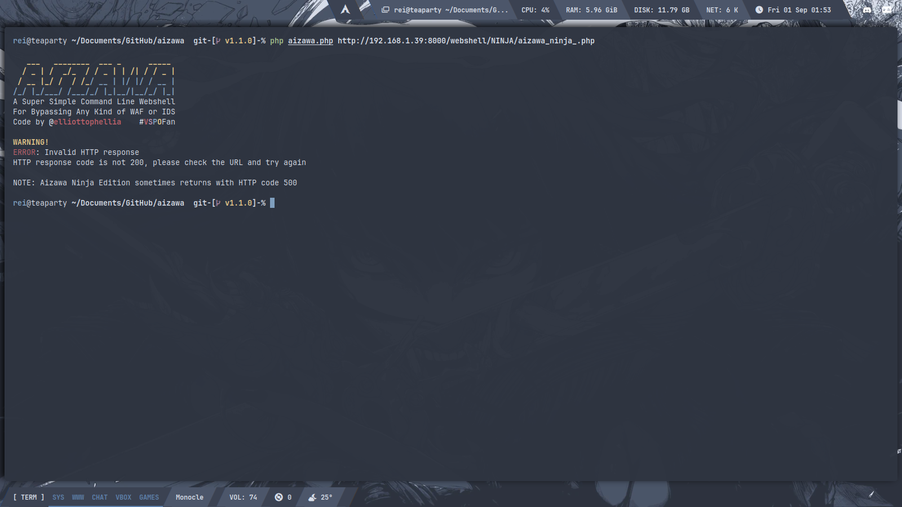

<p align='center'>
<br/><br/>  <br/>
</p>
<h1></h1>
<p align='center'>
<a href="#About"></a> <a href="#Prerequisites"></a> <a href="#Installing"></a> <a href="#Screenshot"></a> <a href="#References"></a> <a href="#Licence"></a> <a href="#Disclaimer"></a>
</p>
<h1></h1>

```
Note:
- NINJA edition as far as I know is not gonna work on PHP 7+
- GET/POST edition is working just fine on PHP 7+

Changelogs - v1.1.0

- Removed HEX encoding webshell
- Removed function.php and just put it in aizawa.php
- Refactored the function to be more efficient and simple
- Changed the way to recognize other webshell extention not just .php
- Added new way to execute commands in webshell with proc_open and popen
- Added an actually useful error message not like before
- Added an actually useful readme.md not like before
```

# About

Aizawa is a super simple command-line webshell that executes commands via the HTTP request in order to avoid any WAF or IDS. The name Aizawa itself is taken from virtual youtuber [Aizawa Ema](https://www.youtube.com/channel/UCPkKpOHxEDcwmUAnRpIu-Ng) from [Virtual Esport Project](https://vspo.jp/). Ema itself is a girl who likes bread and cats. She's always trying to improve her game skills. She wants to be a neat and tidy character, but is she really?

# Prerequisites

- PHP 7.4 or higher
- PHP cURL

# Installing

## 1. Clone this repository
```
git clone http://github.com/elliottopellia/aizawa
```
## 2. Change directory to aizawa
```
cd aizawa
```
## 3. Run aizawa
```
php aizawa.php / php aizawa.php [webshell url]
```
```
NOTE: The one who will be uploaded is the webshell that is in the webshell folder NOT THE AIZAWA.PHP ITSELF
```

# Screenshot






# References

- [s0md3v](https://github.com/s0md3v/nano)
- [Acunetix](https://bit.ly/AcunetiX)
- [Peter Krauss](https://stackoverflow.com/posts/2929951/revisions)
- [Tim Post](https://stackoverflow.com/posts/2929951/revisions)

# Licence

This project is licensed under the GPL 2.0 License - see the [LICENCE](https://github.com/elliottophellia/aizawa/blob/main/LICENSE) file for details

# Disclaimer

This project is for educational purposes only. I will not be responsible for any misuse of this project by any party, or any damage caused by this project.

