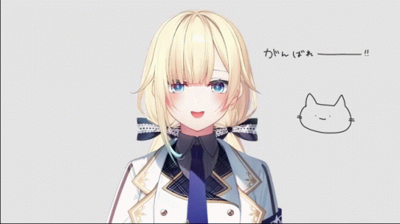
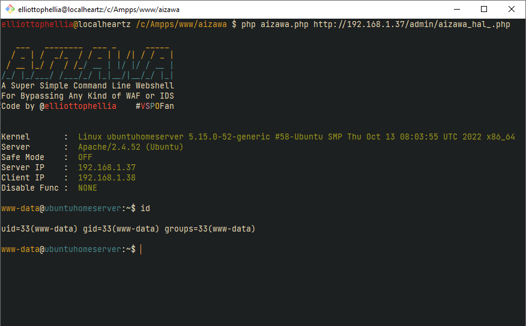
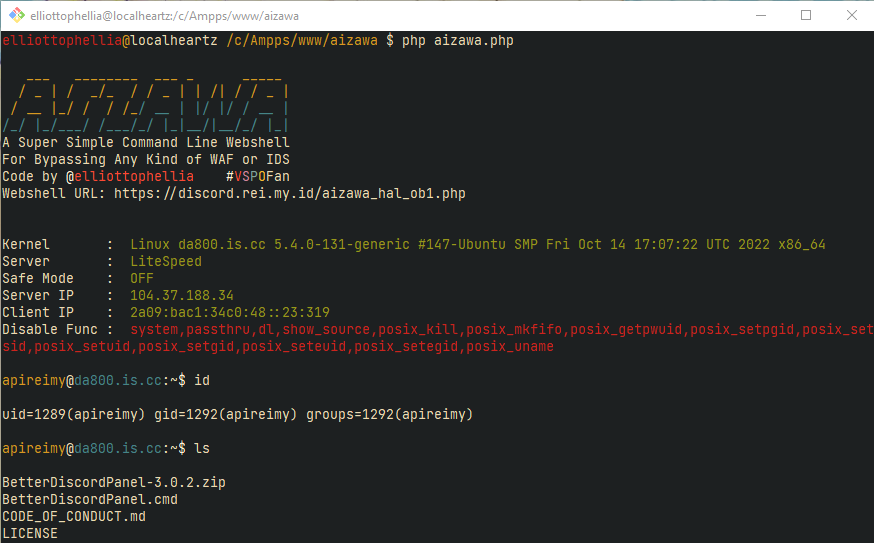

<h1>Aizawa</h1>

   

A super simple command-line webshell that executes commands via the HTTP header in order to avoid any WAF or IDS.

<h1>Installation</h1>
<pre>git clone https://github.com/elliottophellia/aizawa
cd aizawa
php aizawa.php [url]</pre>

<h1>License</h1>

GNU GENERAL PUBLIC LICENSE 
Version 2, June 1991 
 
Copyright (C) 1989, 1991 Free Software Foundation, Inc., 
51 Franklin Street, Fifth Floor, Boston, MA 02110-1301 USA 
Everyone is permitted to copy and distribute verbatim copies 
of this license document, but changing it is not allowed.

<h1>Contribute</h1>

if you want to contribute to this project, you can fork this project and make a pull request, or you can contact me on <a href="https://twitter.com/elliottophellia">twitter</a> or <a href="me@rei.my.id">email</a>.

<h1>Disclaimer</h1>

All kinds of illegal use is prohibited and developer are not responsible for any misuse or damage caused by this program.

